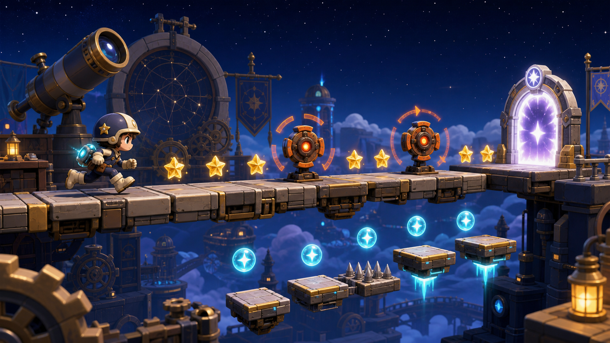
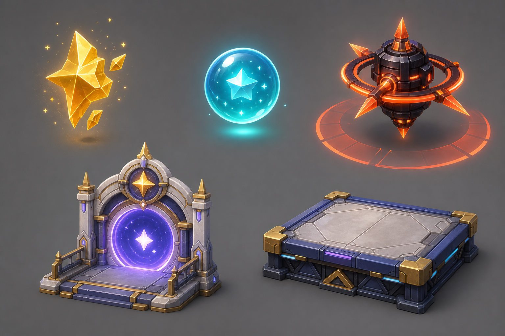

# Codex GameDev Harness

**A practical agentic game-development harness for turning game ideas into playable Unreal projects with Codex, generated art, generated 3D assets, GameDevMCP, and real client/server workflows.**

Codex GameDev Harness is not a collection of prompts. It is a production workflow for using AI agents as a small game team: design, art direction, asset planning, concept visualization, modeling references, 3D asset generation, Unreal Editor automation, implementation planning, validation, and playable build iteration.

The goal is simple:

```text
idea
  -> game design
  -> art direction
  -> concept images
  -> modeling references
  -> 3D asset generation
  -> Unreal import through GameDevMCP
  -> gameplay / UI / client / server implementation
  -> playable validation
```

## Why This Exists

AI can generate code, images, 3D models, and implementation plans, but game development fails when those outputs are disconnected.

A game needs a loop:

- a concept that defines what the game is
- design rules that explain why the game is fun
- systems that turn the concept into play
- art direction that makes assets coherent
- asset lists that map directly to engine objects
- generated references that can become production assets
- editor automation that imports and wires those assets into the project
- validation that proves the result is playable

This repo is the harness around that loop.

## What It Harnesses

| Surface | Role |
|---|---|
| **Codex** | Agentic planning, document maintenance, implementation work, review, and orchestration |
| **Image generation** | Concept art, art direction boards, character sheets, gameplay object references, modeling sheets |
| **3D generation APIs** | Model creation from structured asset briefs and orthographic references |
| **GameDevMCP** | Unreal Editor automation through MCP tools |
| **Unreal Engine** | Final asset import, blueprint authoring, level construction, gameplay validation |
| **Client / server workflows** | Real game code, runtime systems, networking, tooling, and integration plans |

## Core Idea

The harness treats game development as a chain of connected artifacts, not as isolated AI outputs.

```text
Design document
  -> System spec
  -> Feature manifest
  -> Art direction
  -> Asset brief
  -> Concept image
  -> Orthographic modeling reference
  -> 3D model
  -> Unreal asset
  -> Blueprint / code integration
  -> Playable slice
  -> QA result
```

Each step should leave behind something a human can review and an agent can use.

## Current Example: Starball Run

`projects/starball_run_001/` is the first live test project.

It is a small 2.5D platform game slice about collecting star shards and energy orbs, avoiding hazards, and reaching a goal gate. The project is used to test the full pipeline from game design to Unreal-ready gameplay assets.





## Repository Structure

```text
codex-gamedev-harness/
  framework/
    guides/
    schemas/
    templates/

  integrations/
    gamedevmcp_plugin/

  projects/
    sample_game_001/
    starball_run_001/
```

## Project Anatomy

```text
projects/<project_id>/
  design/
  systems/
  art/
    direction/
    concepts/
    characters/
    gameplay_objects/
    environment/
    animation_vfx/
    production/
    reviews/
    work_items/
  engineering/
  ux/
  qa/
  production/
  slices/
  versions/
  project_memory/
```

## GameDevMCP Integration

Codex GameDev Harness is designed to work with GameDevMCP as the Unreal execution layer.

```text
Codex GameDev Harness
  -> GameDevMCP MCP endpoint
    -> Unreal Editor
      -> assets, blueprints, levels, materials, UI, tests
```

The harness defines what should be made. GameDevMCP performs editor-side actions such as asset import, blueprint edits, level placement, inspection, and validation.

## What This Is Not

This is not a one-click game generator.

The point is not to hide game development behind a magic prompt. The point is to make AI-assisted game development inspectable, repeatable, and production-oriented.

This harness is built around small vertical slices:

1. define the game intent
2. define the systems
3. define the assets
4. generate references
5. produce engine-ready assets
6. import and wire them in Unreal
7. validate the playable result
8. expand the slice

## Current Status

Early, active, experimental.

Already represented in this repository:

- game design documents
- art direction documents
- generated concept images
- static mesh asset briefs
- orthographic modeling references
- GameDevMCP integration planning
- Unreal-first playable slice planning

Next maturity targets:

- 3D generation API integration
- generated model import reports
- automated material and collision setup
- gameplay Blueprint assembly
- client/server workflow templates
- repeatable playable build validation

## License

License has not been finalized yet.
