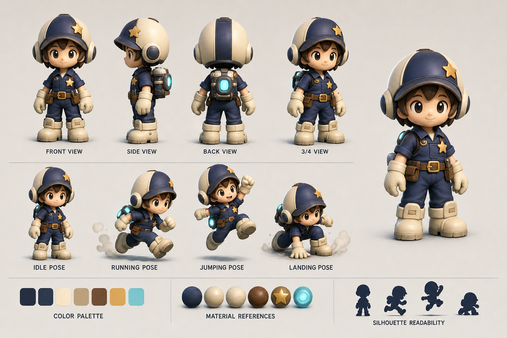

# 주인공 캐릭터 컨셉

## 캐릭터 이름

루미.

현재는 임시명이다. 이름은 바뀔 수 있지만, 아래 컨셉은 유지한다.

## 역할

루미는 별 에너지를 수리하는 작은 공방 기술자다. 전투 영웅이 아니라, 망가진 별 장치를 빠르게 뛰어다니며 고치는 민첩한 수리공이다.

## 캐릭터 reference

| 이미지 | 목적 | 상태 |
|---|---|---|
| `images/concept_reference/character_sheet_v001.png` | 형태, 비율, 포즈, 색상 검토 | 생성 완료, 검토 대기 |

## 성격

| 성격 | 시각 표현 |
|---|---|
| 호기심 많음 | 큰 눈, 고개를 살짝 기울이는 idle |
| 빠름 | 짧은 다리지만 큰 보폭, 앞으로 기운 run pose |
| 꼼꼼함 | 공구 벨트, 작은 가방, 장갑 |
| 겁먹지 않음 | 위험물 앞에서도 몸을 낮추고 준비하는 자세 |

## 실루엣

루미는 화면에서 작게 보이므로 실루엣이 단순해야 한다.

| 부위 | 형태 | 이유 |
|---|---|---|
| 머리 | 둥근 헬멧 또는 후드 | 작은 캐릭터의 큰 머리 실루엣 |
| 머리 장식 | 작고 납작한 별 장식 | 별 수리공 정체성, 단 과하면 안 됨 |
| 몸 | 짧고 둥근 작업복 | 친근하고 빠른 느낌 |
| 손 | 큰 장갑 | 행동과 수집 동작이 잘 보임 |
| 발 | 큰 부츠 | 착지와 점프 판독 |
| 등 | 작은 에너지 팩 또는 공구 가방 | 수리공 역할 강화 |

## 비율

- 키: 게임 월드 기준 약 120~140cm 느낌의 작은 캐릭터.
- 등신: 2.5등신 전후.
- 머리: 전체 키의 35~40%.
- 손/발: 실제 비율보다 크게 과장.
- 장식: 화면 축소 시에도 읽히는 2~3개 포인트만 사용.

## 색상

| 영역 | 색상 | 목적 |
|---|---|---|
| 작업복 | 짙은 남색, 보라 기운 | 밤하늘 배경과 어울림 |
| 장갑/부츠 | 크림색, 밝은 회색 | 손발 위치 판독 |
| 별 장식 | 금색 | 주인공 정체성 |
| 공구/에너지 팩 | 청록 발광 | 에너지 수리공 느낌 |
| 얼굴/눈 | 따뜻한 흰색 또는 연노랑 | 감정 표현 |

## 움직임

### Idle

- 한 손으로 작은 공구를 만진다.
- 헬멧의 별 장식이 아주 약하게 빛난다.
- 몸은 1초에 한 번 정도 작게 호흡한다.

### Run

- 상체가 진행 방향으로 10~15도 기운다.
- 큰 부츠가 과장된 리듬으로 움직인다.
- 뒤쪽 에너지 팩에서 짧은 청록색 잔상이 나온다.

### Jump

- 점프 시작 전 2~3프레임 정도 몸을 낮춘다.
- 공중에서는 팔을 살짝 벌리고 별 장식이 반짝인다.
- 회전은 과하게 하지 않는다. 캐릭터의 앞/뒤 방향이 계속 읽혀야 한다.

### Fall

- 발을 아래로 내리고 팔을 벌려 균형을 잡는다.
- 빠르게 떨어질 때 작은 청록 잔상이 길어진다.

### Land

- 부츠가 먼저 닿고 몸이 짧게 눌렸다가 회복된다.
- 큰 먼지 효과보다 작은 별가루 효과를 사용한다.

### Collect

- 수집물과 닿는 순간 루미의 에너지 팩이 짧게 반짝인다.
- 큰 모션보다 0.2초 안팎의 빠른 피드백이 좋다.

### Damage / Fail

- 몸이 뒤로 튕기고 헬멧 별 장식이 잠깐 꺼진다.
- 과한 고통 표현이나 잔혹 표현은 쓰지 않는다.

## 금지 방향

- 별 모양 자체가 걸어다니는 캐릭터.
- 광대, 서커스 단원, 레이드 보스 느낌.
- 검, 창, 총 같은 전투 무기 중심 캐릭터.
- 복잡한 갑옷이나 긴 로브.
- 얼굴 표정이 너무 복잡해 작은 화면에서 지저분해지는 디자인.

## 제작 산출물

| 산출물 | 목적 | 버전 |
|---|---|---|
| 캐릭터 컨셉 시트 | 정면/측면/후면, 기본 포즈 | v0.3 |
| 이동 포즈 시트 | idle/run/jump/fall/land | v0.3 |
| proxy 메시 | 게임 내 크기와 실루엣 검증 | v0.3 |
| 최종 모델 | rig/animation 적용 | v0.5 이후 |
