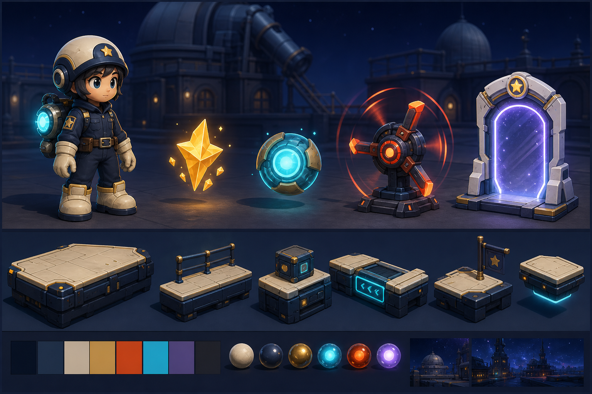

# 아트 방향성

## 한 줄 방향

밝은 밤하늘의 천문 공방에서 작은 별 수리공이 달리고 고치는, 읽기 쉬운 stylized 2.5D 플랫폼 게임.

## 아트 원칙

| 원칙 | 의미 | 검증 방법 |
|---|---|---|
| 판독성이 장식보다 우선 | 플레이어, 발판, 위험, 보상, 골이 배경보다 먼저 보여야 한다 | 화면을 축소해도 요소가 구분되는가 |
| 형태 언어를 분리 | 안전/보상/위험/목표의 실루엣을 다르게 만든다 | 색을 빼도 역할을 알 수 있는가 |
| 주인공은 별이 아니라 수리공 | 별 모티프는 장식이고, 캐릭터 본체는 작은 작업자다 | 캐릭터가 작업복/공구/헬멧으로 읽히는가 |
| 배경은 조용한 세계관 | 천문 공방 분위기는 주지만 플레이 경로를 방해하지 않는다 | 배경 장식이 수집물보다 튀지 않는가 |
| 따뜻한 위험, 차가운 보상 | 위험은 주황/빨강, 보상은 금색/청록으로 나눈다 | 위험물과 수집물을 즉시 구분하는가 |

## 형태 언어

| 요소 | 형태 | 이유 |
|---|---|---|
| 루미 | 둥근 몸, 큰 부츠, 별 장식 헬멧 | 작고 민첩하며 친근한 조작 주체 |
| 별 조각 | 각진 작은 별 파편 | 경로 안내와 기본 보상 |
| 에너지 공 | 완전한 원형 구슬 | 보너스 보상, 안전한 느낌 |
| 위험 장치 | 뾰족한 방열판, 회전 링, 경고선 | 피해야 할 대상 |
| 골 게이트 | 안정적인 아치, 중심 별핵 | 도착지와 문 |
| 발판 | 직사각형 모듈, 굵은 모서리 | 충돌 범위가 명확해야 함 |
| 배경 | 큰 원, 기어, 망원경 실루엣 | 천문 공방 정체성 |

## 색상 기준

| 요소 | 색상 방향 | 명도/채도 | 비고 |
|---|---|---|---|
| 루미 작업복 | 짙은 남색, 보라 기운 | 중간 명도, 낮은 채도 | 배경과 겹치면 금색/크림색 테두리로 분리 |
| 루미 장갑/부츠 | 크림색, 밝은 회색 | 높은 명도 | 작은 캐릭터의 손발 위치를 읽게 함 |
| 루미 별 장식 | 금색 | 높은 채도 | 주인공 정체성 포인트 |
| 별 조각 | 금색, 노랑 | 높은 명도/채도 | 기본 수집물 |
| 에너지 공 | 청록, 하늘색 | 높은 명도/채도 | 보너스 수집물 |
| 위험 장치 | 주황, 빨강 | 높은 채도 | 경고 역할 |
| 골 게이트 | 흰색, 보라, 금색 | 높은 명도 | 도착지 |
| 발판 | 남회색, 금속 모서리 | 중간 명도, 낮은 채도 | 플레이 경로 |
| 배경 | 짙은 파랑, 보라, 낮은 대비 | 낮은 채도 | 플레이 요소보다 뒤로 물러남 |

## 화면 우선순위

1. 루미의 위치와 진행 방향
2. 다음 발판과 착지 지점
3. 위험 장치와 위험 범위
4. 별 조각/에너지 공
5. 골 게이트
6. 배경 장식

## 현재 기준 이미지

아래 이미지는 현재 문서 기준으로 생성한 검토용 reference다. 아트 방향 검토는 이 이미지를 기준으로 진행한다.

| 이미지 | 목적 | 상태 |
|---|---|---|
| `images/concept_reference/art_direction_overview_v001.png` | 전체 아트 방향 요약 | 생성 완료, 검토 대기 |
| `../concepts/images/concept_reference/concept_overview_v002.png` | 첫 스테이지 화면 분위기 | 생성 완료, 검토 대기 |
| `../gameplay_objects/images/concept_reference/core_objects_v002.png` | 수집물/위험물/골/발판 방향 | 생성 완료, 검토 대기 |

## 금지 방향

- 주인공을 별 모양 생명체로만 그리는 방향
- 광대, 서커스, 공포 레이드 보스 느낌
- 복잡한 갑옷, 마법사 로브, 거대한 무기
- 배경이 너무 화려해서 발판과 위험물이 묻히는 화면
- 수집물과 위험물이 색상만 다르고 형태가 비슷한 디자인
- UI나 텍스트가 컨셉 이미지 안에 과도하게 들어가는 구성
