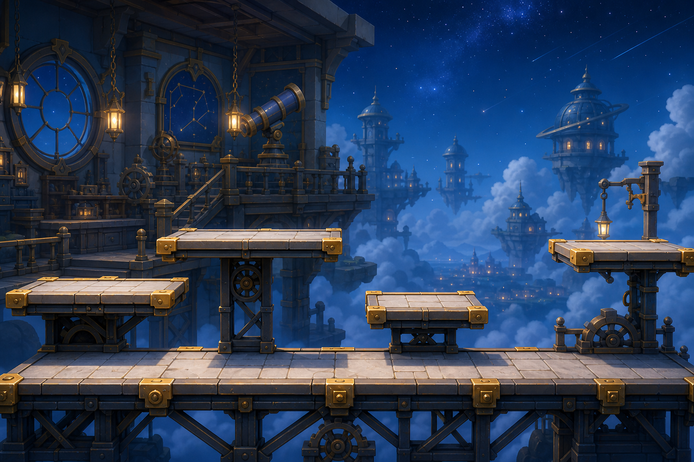

# 환경 컨셉

## 첫 스테이지 이름

천문 공방 상층.

## 핵심 이미지

하늘 위에 떠 있는 별 수리 공방의 외곽 통로. 플레이어는 공방 바깥쪽 발판을 따라 이동하고, 뒤쪽에는 거대한 망원경, 기어, 별지도, 구름 아래 도시 불빛이 낮은 대비로 보인다.

## 환경 reference

| 이미지 | 목적 | 상태 |
|---|---|---|
| `images/concept_reference/environment_key_v001.png` | 배경 레이어, 플레이 경로 대비, 천문 공방 분위기 검토 | 생성 완료, 검토 대기 |

## 레이어 구조

| 레이어 | 역할 | 밝기/대비 | 예시 요소 |
|---|---|---|---|
| 플레이 레이어 | 실제 상호작용 오브젝트와 루미가 놓이는 레이어. 세부 기준은 `../gameplay_objects/gameplay_object_concepts.md`와 `../characters/lumi_character_concept.md`를 따른다 | 가장 선명한 기준을 유지해야 함 | 링크 문서 참조 |
| 근경 장식 | 세계관 장식, 충돌 없음 | 중간 대비 | 난간, 작은 램프, 매달린 도구 |
| 중경 | 공방 규모감 | 낮은 대비 | 망원경, 기어, 별지도 벽 |
| 원경 | 하늘과 깊이감 | 가장 낮은 대비 | 별하늘, 구름, 먼 도시 실루엣 |

## 색상과 조명

- 기본 배경: 짙은 파랑, 보라 기운.
- 플레이 레이어 오브젝트의 색상과 발광 기준은 `../gameplay_objects/gameplay_object_concepts.md`를 따른다.
- 루미의 색상과 실루엣 기준은 `../characters/lumi_character_concept.md`를 따른다.
- 배경 조명은 수집물, 위험물, 골 게이트, 루미보다 낮은 대비여야 한다.
- 배경 별빛과 장식광은 실제 수집물/위험물로 오해될 만큼 밝거나 선명하면 안 된다.

## 배경 장식 기준

| 장식 | 사용 이유 | 주의 |
|---|---|---|
| 망원경 | 천문 공방 정체성 | 너무 크면 플레이어보다 눈에 띔 |
| 기어 | 공방 장치 느낌 | 위험 장치와 혼동되지 않게 낮은 채도 |
| 별지도 | 세계관 설명 | 텍스트/기호를 과하게 넣지 않음 |
| 램프 | 플레이 경로 깊이감 | 수집물 색과 겹치지 않음 |
| 구름/도시 | 높이감 | 채도 낮게 처리 |

## 금지 방향

- 어두운 공포 배경.
- 서커스 천막, 광대 장식, 축제 무대.
- 수집물과 같은 밝기의 배경 별.
- 플레이 레이어 오브젝트의 충돌 범위와 실루엣을 가리는 장식.
- 너무 현실적인 산업 공장.

## 제작 산출물

| 산출물 | 목적 | 버전 |
|---|---|---|
| 환경 키 이미지 | 첫 스테이지 분위기 확정 | v0.3 |
| 배경 parallax rough | 레이어 깊이 검증 | v0.3 |
| 플레이 레이어 대비 rough | 배경이 게임플레이 오브젝트를 방해하지 않는지 검증 | v0.3 |
| 장식 prop set | 공방 정체성 강화 | v0.4 |
